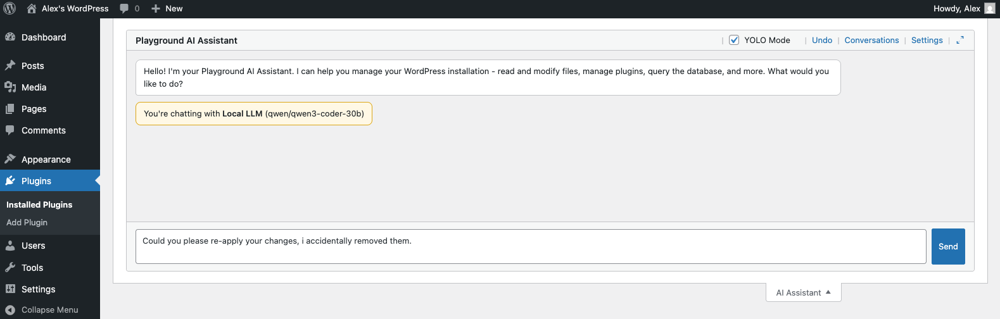

# Playground AI Assistant

An AI-powered chat interface for WordPress Playground. Bring your own API key or connect to a local LLM.

## Features

- **Multiple LLM Providers**: Anthropic (Claude), OpenAI, and local models via Ollama/LM Studio
- **Browser-Side API Calls**: Connect to local LLMs even when WordPress is hosted remotely
- **Tool System**: Execute PHP, read/write files, search WordPress docs
- **Change Tracking**: All AI modifications are tracked with full diff history
- **Revert & Reapply**: Undo any AI change and optionally reapply it later
- **Patch Export/Import**: Download changes as `.patch` files or apply patches from elsewhere
- **Conversation History**: Persistent storage with automatic summarization
- **Streaming Responses**: Real-time output as the AI generates responses

## Requirements

- WordPress 6.0+
- PHP 7.4+
- WordPress Playground environment

## Installation

1. Upload the plugin to `/wp-content/plugins/playground-ai-assistant`
2. Activate through the Plugins menu
3. Configure your API keys in Settings > AI Assistant

## Configuration

Go to **Settings > AI Assistant** to configure:

- **Provider**: Choose between Anthropic, OpenAI, or Local (Ollama/LM Studio)
- **Model**: Select which model to use
- **API Keys**: Enter your provider API keys
- **Local Endpoint**: Configure Ollama/LM Studio endpoint (default: `http://localhost:11434`)

## Usage

The AI Assistant panel appears in the WordPress admin screen meta area (alongside Help and Screen Options). Click to expand and start chatting.

### Available Tools

| Tool | Description |
|------|-------------|
| `run_php` | Execute PHP code |
| `read_files` | Read file contents |
| `write_file` | Create or modify files |
| `get_page_html` | Fetch current page HTML |
| `search_wordpress_docs` | Search WordPress documentation |

### YOLO Mode

Enable the YOLO checkbox to skip confirmation dialogs for tool execution. Use with caution.

## AI Changes

Find this under **Tools > AI Changes**. Every file the AI creates or modifies is tracked here.

- **View diffs**: Click any file to see exactly what changed
- **Revert**: Restore any file to its original state
- **Reapply**: Re-apply previously reverted changes
- **Export**: Select files and download a unified `.patch` file
- **Import**: Apply patch files to your installation
- **PHP Linting**: Automatic syntax checking for PHP files

This makes it safe to experiment—you can always undo what the AI did.

### Recovery Mode Integration

If the AI writes code that breaks WordPress (e.g., a PHP syntax error), the assistant detects consecutive failed requests and warns you that something is wrong—while the current page still works.

To recover:

1. Click the grid icon in the Playground top bar
2. Select **Recovery Mode** to boot into troubleshooting mode
3. Activate the AI Assistant plugin and go to **Tools → AI Changes**
4. Revert the problematic changes

The recovery screen highlights recently modified plugins to help identify the culprit.

## License

GPL-2.0-or-later. See [LICENSE](LICENSE) for details.
